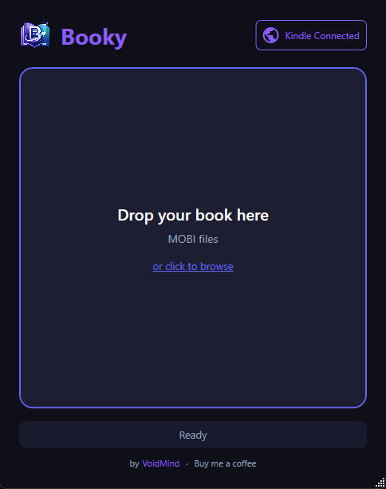

# Booky

A lightweight Windows app that converts MOBI files to EPUB and sends them directly to your Kindle. No Calibre, no email workarounds - just drag and drop.



## Features

- **MOBI to EPUB conversion** - Converts Kindle MOBI files to standard EPUB format
- **Direct Send to Kindle** - Native integration with Amazon's Send to Kindle service
- **EPUB passthrough** - Drop EPUB files to send them directly without conversion
- **Batch processing** - Convert and send multiple books at once
- **Metadata editing** - Edit title and author before conversion
- **Explorer integration** - Right-click context menu for quick access
- **Dark theme** - Easy on the eyes

## Installation

Download the latest installer from the [Releases](https://github.com/voidmind-io/Booky/releases) page.

> **Note:** Windows SmartScreen may show an "Unknown Publisher" warning because the app isn't code-signed. Click **"More info"** → **"Run anyway"** to install.

Or build from source (see below).

## Usage

1. **Drag and drop** a MOBI or EPUB file onto the window (or click to browse)
2. **Edit metadata** if needed (title, author)
3. **Convert** (MOBI only) - choose where to save the EPUB
4. **Send to Kindle** - requires one-time Amazon login

### Context Menu

After installation, right-click any `.mobi` or `.epub` file in Explorer:
- `.epub` → "Send to Kindle with Booky"
- `.mobi` → "Convert & Send to Kindle with Booky"

*On Windows 11, these appear under "Show more options"*

## Building from Source

### Requirements

- .NET 8 SDK
- Windows 10/11

### Build

```bash
# Debug build
dotnet build Booky.csproj

# Release build (single file)
dotnet publish Booky.csproj -c Release -r win-x64 --self-contained true -p:PublishSingleFile=true -o publish

# Copy tools
cp -r Tools publish/
```

### Create Installer

Requires [Inno Setup 6](https://jrsoftware.org/isinfo.php):

```bash
"%LOCALAPPDATA%\Programs\Inno Setup 6\ISCC.exe" installer.iss
```

Output: `installer/BookySetup.exe`

## Third-Party Libraries

Booky uses the following open source libraries:

| Library | License | Purpose |
|---------|---------|---------|
| [libmobi](https://github.com/bfabiszewski/libmobi) | LGPL-3.0 | MOBI file parsing and conversion |
| [HtmlAgilityPack](https://html-agility-pack.net/) | MIT | HTML parsing for EPUB generation |
| [WebView2](https://developer.microsoft.com/en-us/microsoft-edge/webview2/) | BSD | Amazon login integration |

The libmobi license is included in `Tools/COPYING.libmobi`.

## Limitations

- Windows only (WPF application)
- DRM-protected files are not supported
- Send to Kindle requires an Amazon account

## License

MIT License - see [LICENSE](LICENSE)

## Support

If Booky saves you time, consider [buying me a coffee](https://buymeacoffee.com/voidmind).

---

Made by [VoidMind](https://voidmind.io/)
